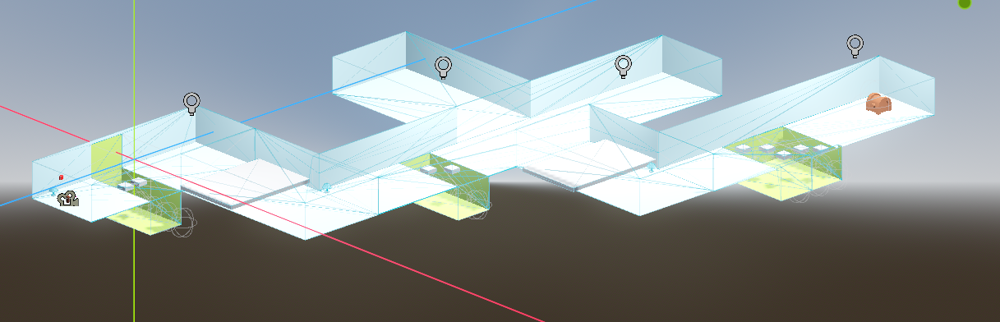
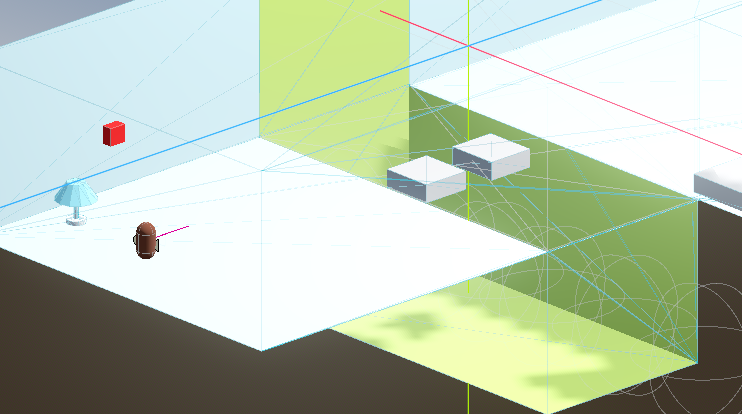
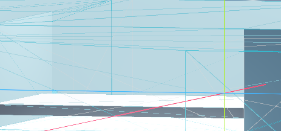
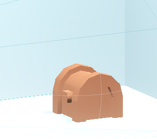
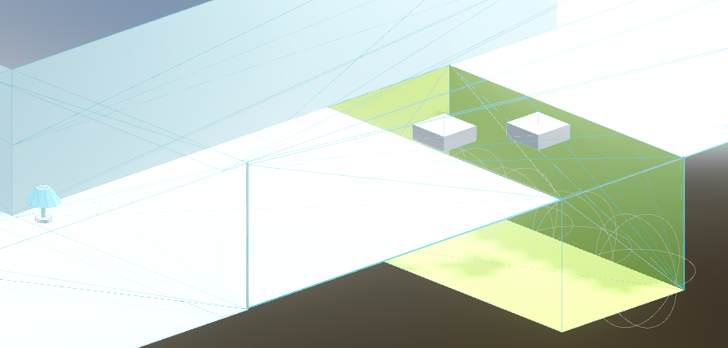
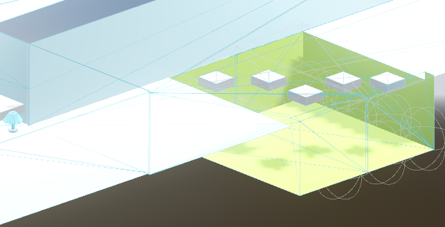

# Tutorial 7
Here's everything I did for this tutorial's *latihan mandiri*:<br>
1. Level Design<br>
<br>
This is what my level design looks like. I know the tutorial was intended to be a FPS, but the nature of 3D design made me want to make it more like an obstacle course of sorts, so I did just that.<br>
<br>
There's a light switch in the beginning of the level, right before the first obstacle.<br>
<br>
There are obstacles that require you to crouch (that you can't jump over).<br>
<br>
The last part of this level is a chest that becomes the finish line. Walking to it will lead you to the win screen, which when pressed will restart the level (because I haven't made a new level).
2. Crouching<br>
I implemented crouch, lowering the collision shape of the player and slowing the player body when they're crouching.<br>
```
extends CharacterBody3D

@export var speed: float = 8.0
@export var sprint_speed: float = 15.0
@export var crouch_speed: float = 5.0
@export var acceleration: float = 5.0
@export var gravity: float = 9.8
@export var jump_power: float = 5.0
@export var mouse_sensitivity: float = 0.3
@export var crouch_height: float = 1.0
@export var normal_height: float = 2.0

@onready var head: Node3D = $Head
@onready var camera: Camera3D = $Head/Camera3D
@onready var collision_shape: CollisionShape3D = $CollisionShape3D

var camera_x_rotation: float = 0.0
var is_crouching: bool = false

    ...

func _physics_process(delta):
	var movement_vector = Vector3.ZERO
	var current_speed = speed

	...

	# Ctrl
	if Input.is_action_pressed("crouch"):
		is_crouching = true
		current_speed = crouch_speed
	else:
		is_crouching = false

	var target_height = crouch_height if is_crouching else normal_height
	collision_shape.shape.height = lerp(collision_shape.shape.height, target_height, delta * 10)

    ...

```
3. Sprinting
```
extends CharacterBody3D

@export var speed: float = 8.0
@export var sprint_speed: float = 15.0
@export var crouch_speed: float = 5.0
@export var acceleration: float = 5.0
@export var gravity: float = 9.8
@export var jump_power: float = 5.0
@export var mouse_sensitivity: float = 0.3
@export var crouch_height: float = 1.0
@export var normal_height: float = 2.0

@onready var head: Node3D = $Head
@onready var camera: Camera3D = $Head/Camera3D
@onready var collision_shape: CollisionShape3D = $CollisionShape3D

...

func _physics_process(delta):
	var movement_vector = Vector3.ZERO
	var current_speed = speed

	# Shift
	if Input.is_action_pressed("sprint"):
		current_speed = sprint_speed

	...

	velocity.x = lerp(velocity.x, movement_vector.x * current_speed, acceleration * delta)
	velocity.z = lerp(velocity.z, movement_vector.z * current_speed, acceleration * delta)

    ...

```

4. Checkpoints<br>
<br>
<br>
<br>
There's a checkpoint in the form of a lamp before each obstacle that could cause you to fall into the pit. Upon falling into the pit, you will be teleported next to the lamp checkpoint. This makes it a nicer experience compared to reloading the scene multiple times. This is how I modified AreaTrigger to accomodate for this while still being usable for the goal area:
```
@export var target_node_path: NodePath
func _on_body_entered(body):
	if body.get_name() == "Player":
		Input.set_mouse_mode(Input.MOUSE_MODE_VISIBLE)
		if get_tree().current_scene.name == sceneName:
			var target_node = get_node(target_node_path)
			if target_node:
				var teleport_offset = Vector3(2, 0, 0)
				body.teleport_to(target_node.global_transform.origin + teleport_offset)
				Input.set_mouse_mode(Input.MOUSE_MODE_CAPTURED)
		else:
			get_tree().call_deferred("change_scene_to_file", "res://scenes/" + sceneName + ".tscn")
```
The node path is basically the lamp node that becomes the checkpoint.